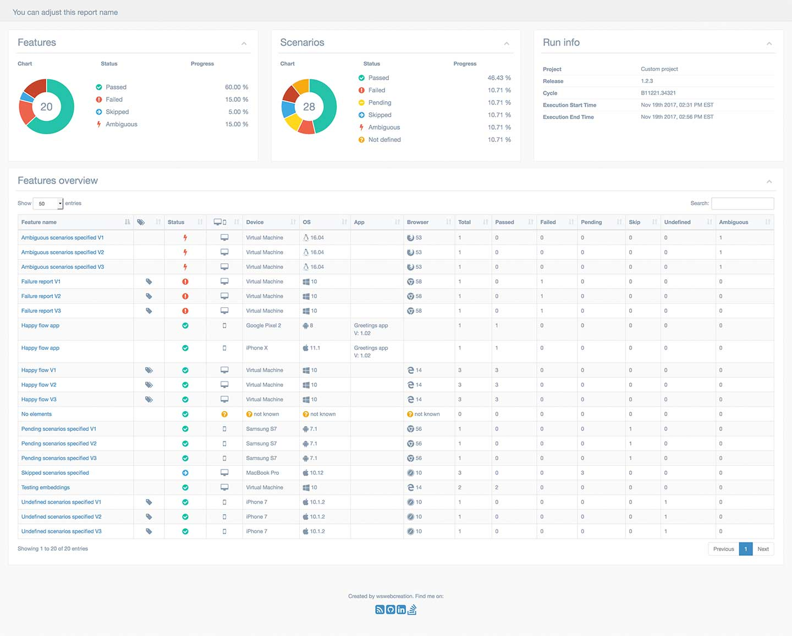

## Description

# Test Automation Framework in Cucumber

## Protractor

Protractor is an end-to-end test framework for Angular and AngularJS applications. Protractor runs tests against your application running in a real browser, interacting with it as a user would. <br>

https://www.protractortest.org/#/

<p align="center">
  <a href="https://www.protractortest.org/" target="blank"></a>
</p>

## Cucumber
Cucumber Behavior Driven Development (BDD) framework allows automation of functional validation in easily readable and understandable format (like plain English) to Business Analysts, Managers, developers... as well as non-technical people...

Behavior Driven Development is an extension of Test Driven Development and it is used to test the system rather than testing the particular piece of code unlike unit or integration tests.

https://cucumber.io/  <br>
https://www.npmjs.com/package/protractor-cucumber-framework

<p align="center">
  <a href="https://www.protractortest.org/" target="blank"></a>
</p>

## Installation

```bash
After clonning the project.

$ npm install
```

## Running the test

```bash
# Running Cross Browser Tests on Chrome and Firefox browsers
$ cd e2e/conf
$ protractor crossBrowserConf.js

# running Tests only on Chrome browsers
$ cd e2e/conf
$ protractor chromeConf.js

# running Tests only on firefox browsers
$ cd e2e/conf
$ protractor firefoxBrowserConf.js


# running Tests only on batch
$ testP.bat


```

## Reports
```bash

Test result reports can reached through the location given below: 
Index.html file is refreshed with the latest test results after each test run.
This code also backups the older reports in to a backup folder out of root called "reportsBackup"
/broadcast/report/index.html

```
<br>
<br>


<p align="center">
  <a ></a>
</p>

<br>
<br>

<p align="center">
  <a ></a>
</p>
